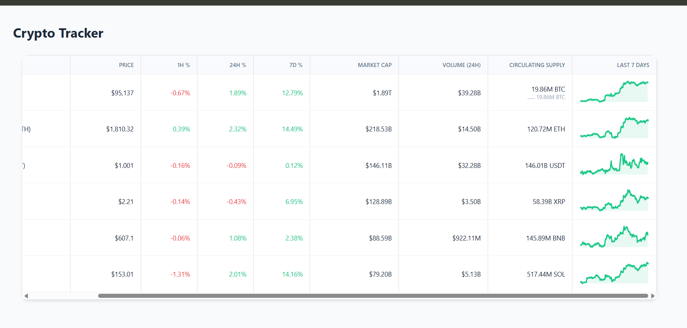
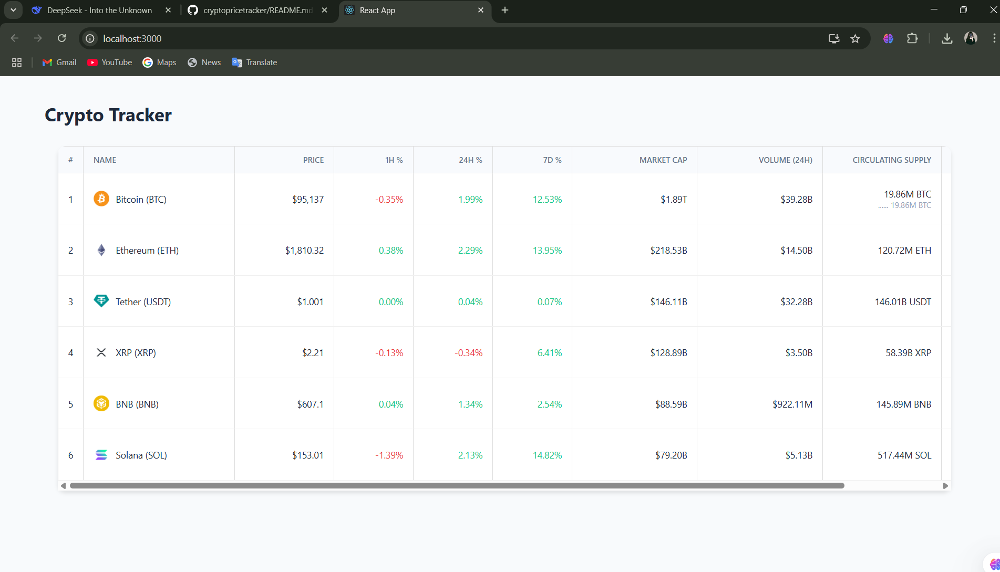

# Crypto Price Tracker 💹

Real-time cryptocurrency price dashboard built with React + Redux Toolkit.

## Features
- Live price updates (simulated WebSocket)
- 5 crypto assets tracked (BTC, ETH, USDT, etc.)
- Color-coded % changes (green/red)
- Responsive table view
- 7-day price chart

## Setup
```bash
git clone https://github.com/Maramakhila/cryptopricetracker.git
cd cryptopricetracker
npm install
npm start

## App Screenshots

### Desktop View (Detailed Metrics)  
  

### Mobile View (Compact Layout)  
                                                                                    